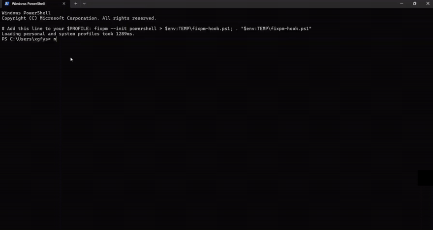

# fixpm

<!-- TODO(badges): CI status, PyPI version, Python versions, license -->

**Interactive command fixer for npm / npx / pnpm / yarn typos.**

You typed `npm isntall react`. Your terminal yelled at you. `fixpm` knows what you meant — pick the fix with arrow keys, press Enter, done.

## Why

Package-manager CLIs fail in very predictable ways: a mistyped subcommand (`isntall`), a missing flag prefix (`save-dev` instead of `--save-dev`), or a mistyped package name (`loadash`). Generic "did you mean" tools don't understand that `add` is valid for `yarn` but means `install` on `npm`, or that `--frozen-lockfile` belongs to `pnpm install`.

`fixpm` ships a declarative rule table per package manager plus live npm-registry lookups, so suggestions are syntax-aware, not just string-similar.

## Features

- **Automatic detection** — a tiny zsh/bash hook notices when an `npm`-family command exits non-zero and nudges you.
- **Five error classes**: subcommand typo, flag typo, missing flag prefix (`--`), missing required argument, package-name typo.
- **Registry-backed package fixes** — candidates ranked by edit distance *and* weekly download count (typos like `loadash` → `lodash`, never a dead lookalike package).
- **Interactive or one-shot** — arrow-key selection, or `--dry-run` to print fixes.
- **Extensible rule tables** — adding a manager or command is editing a data table, not writing code.

## Install

```bash
pipx install fixpm      # recommended
# or
pip install --user fixpm
```

> Note: verify the `fixpm` name is free on PyPI before your first release; if taken, rename the distribution in `pyproject.toml` (`name = ...`) — the console command can stay `fixpm`.

## Setup

Enable automatic failure detection (zsh):

```bash
echo 'eval "$(fixpm --init zsh)"' >> ~/.zshrc
```

or bash:

```bash
echo 'eval "$(fixpm --init bash)"' >> ~/.bashrc
```

No hook? Works manually too:

```bash
fixpm "npm isntall react"     # quote multi-token commands
```

## Demo

Text walkthrough of the interaction:

```console
$ npm isntall react --save-dev
npm ERR! Unknown command: "isntall"

  ↯ fix available — run fixpm        ← printed automatically by the hook

$ fixpm
? Apply a fix: (↑/↓ move · enter select · ctrl+c cancel)
❯ npm install react --save-dev   · command fix · 95%
  Skip — do nothing

→ npm install react --save-dev   ← executed after Enter
added 42 packages in 3s
```

<!-- TODO(demo): replace with an asciinema recording / GIF once published.
 -->

### What it catches

| You type | fixpm suggests | Class |
| --- | --- | --- |
| `npm isntall react` | `npm install react` | subcommand typo |
| `npm i loadash` | `npm i lodash` | package typo (registry-checked) |
| `npm install express save-dev` | `npm install express --save-dev` | missing flag prefix |
| `npm run` | `npm run <script>` | missing argument (not auto-executed) |
| `pnpm ad left-pad` | `pnpm add left-pad` | subcommand typo |
| `yarn globla add vite` | `yarn global add vite` | subcommand typo |
| `npx creat-react-app web` | `npx create-react-app web` | package typo |

## How it works

1. The shell hook exports `$FIXPM_LAST_COMMAND` / `$FIXPM_LAST_EXIT_CODE`; `fixpm` reads them (or takes the command as arguments).
2. `detector.py` tokenizes the line, finds the manager binary, and classifies each issue against that manager's rule table.
3. `corrector.py` turns issues into concrete commands; package typos go through `packages.py`, which queries the npm registry search API and ranks by `0.62 × edit-distance similarity + 0.38 × log(weekly downloads)` (clamped). Network failures degrade gracefully to a small curated typo map — the tool never crashes offline.

## Troubleshooting

**The hook never prints a hint after a failed npm command.**

1. Make sure the probe itself finds suggestions:
   ```bash
   fixpm --dry-run "npm isntall react"   # must exit 0 and print fixes
   ```
   If it prints `No fix found`, the typo simply isn't covered yet — the hook stays silent by design. PRs adding rules are welcome.
2. Make sure `fixpm` is actually on PATH *in that shell* (`command -v fixpm`). `pip install --user` puts it in Python's `Scripts` directory, which is often not on PATH — prefer `pipx`, or add the directory manually.
3. Still stuck? Re-run the failing command with `FIXPM_DEBUG=1` exported — the hook then shows why its probe failed instead of swallowing errors.

## Contributing

Contributions welcome — especially **rule tables** for pnpm/yarn coverage.

```bash
git clone https://github.com/YOUR_GH_USER/fixpm && cd fixpm
pip install -e ".[dev]"
ruff check . && pytest
```

### Adding a rule

Rules are data, not code. To teach `fixpm` a new command, alias, flag, or common misspelling, edit the relevant table in `src/fixpm/rules/`:

```python
# src/fixpm/rules/npm.py
NPM = register(
    ManagerSpec(
        name="npm",
        binaries=("npm",),
        commands=("install", "run", "publish", ...),   # canonical top-level commands
        aliases={"i": "install", "innit": "init"},      # alt spelling -> canonical
        flags={"install": ("--save-dev", "-D", ...)},   # validated flags per command
        typo_hints={"isntall": "install"},              # deterministic overrides
    )
)
```

Guidelines:

- One PR per logical change (a new manager, a batch of flags, …).
- Add a pytest case in `tests/test_corrections.py` for every new behavior.
- Flag lists may be partial — unknown flags on unlisted commands are simply not validated (conservative by design).

See [CONTRIBUTING notes above](#contributing); open an issue first for new package managers.

## Roadmap

- [ ] Deeper pnpm / yarn (Berry) flag coverage
- [ ] fish & PowerShell hooks
- [ ] Validate `npm run <script>` against local `package.json`
- [ ] On-disk registry cache with TTL
- [ ] `fixpm --explain` (why this suggestion)

## License

[MIT](LICENSE)
